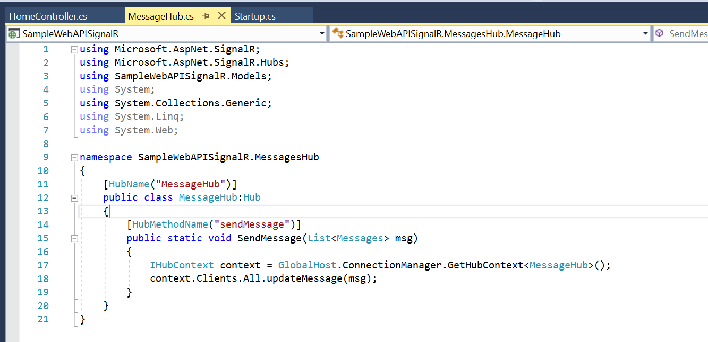
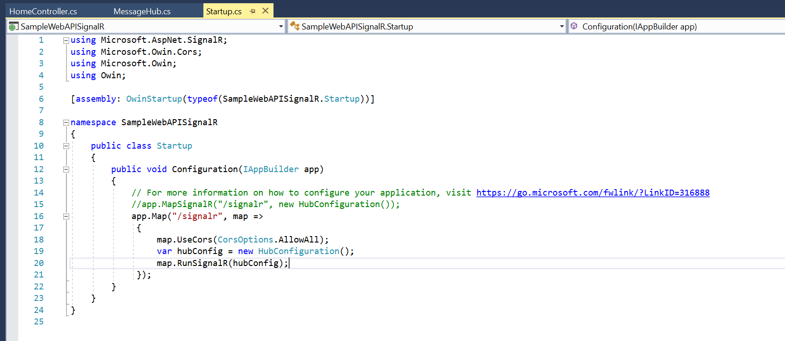
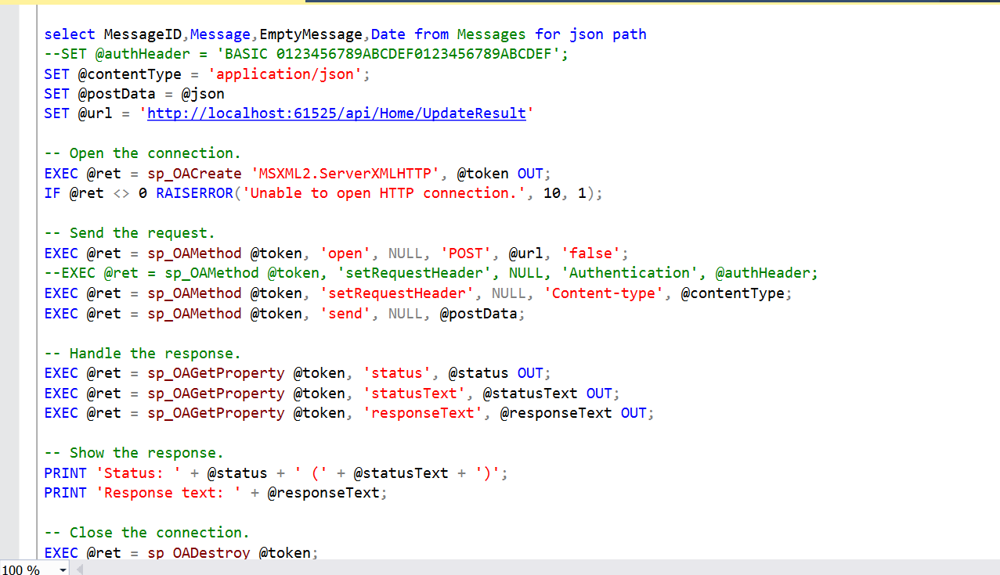
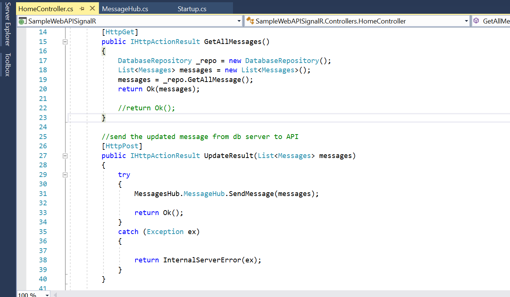
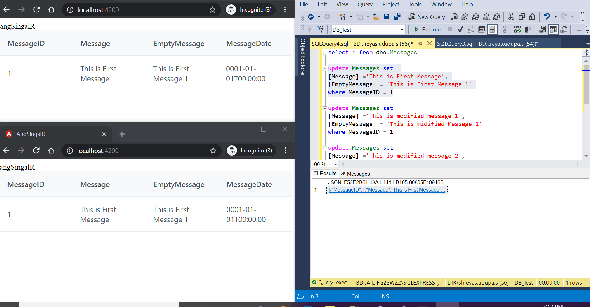

# SignalR used in angular to get updated data from database (without Refresh).
SignalR used to connect the client with the Hub.

I have created an application that does not require hard refresh to see the updated value from the Database to the UI Dashboard.

API
Create a API for signalR Hub , I have used APS.NET WEB API 2 and installed Owin startup as my starup class

Next create a Hub where the client will connect to the server, here is the code for the hub

Here SendMessage in the Hub method that will be accessed by controller inorder to push the data to the client , but updateMessage is the message that is method is accessed by the client (dont get confused).

Next enable cors in signalR in Startup class or else signalR client will not be able to connect to this API 

Next, I have written a Trigger that inturn calls the APIs when there is a update in the database as shown below

API will push the data to all the client connected to the hub as shown below : calls the hubMethod which inturn push the data to updatemessage method

Here is the Demo of the project

Refrences:
https://stackoverflow.com/questions/41378582/angular-2-typescript-using-signalr
https://stackoverflow.com/questions/54297637/how-to-hook-up-signalr-with-an-angular-7-application
https://docs.microsoft.com/en-us/aspnet/signalr/overview/guide-to-the-api/hubs-api-guide-javascript-client
https://www.zealousweb.com/calling-rest-api-from-sql-server-stored-procedure/
