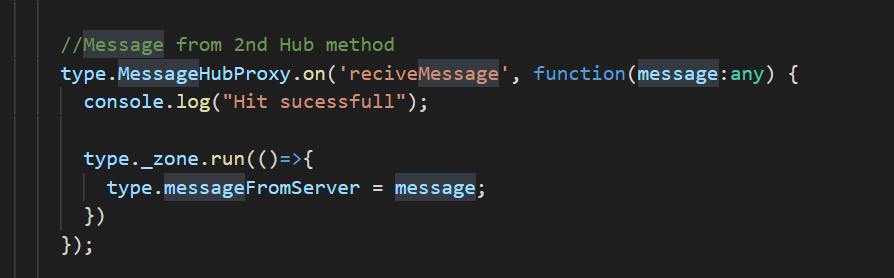

# SignalR used in angular to get updated data from database (without Refresh).
SignalR used to connect the client with the Hub.

I have created an application that does not require hard refresh to see the updated value from the Database to the UI Dashboard.

Here is the Demo of the project

  

  <b>Steps to recreate the above project</b>  
  

  

  <b><h4>API Methods</h4></b>
    
 Create a API for signalR Hub , I have used APS.NET WEB API 2 and installed Owin startup as my starup class

     
Next create a Hub where the client will connect to the server, here is the code for the hub

  

  
  
 
The first image shows OnConnected Task when the client initally connects with the signalR Hub (client connection is shown after this topic) will logs the connection in the
dictonary table and <b>SendMessage</b> method will send message back to client (client which will be listning to the server to push the content) to those connection which are present in the dictonary list. The second image shows below shows <b>RecieveMessage </b> how to recieve message from client once the connection is made and then that method is sending the message back to that particular client usiing the connectionID. Next shows the OnDisconnected which will be called when user closes the tab then remove the connection from dictonary table. Use the dictonary table only if you have one server if you have multiple server (load balancing) then create a Database table for this purpose and store in the table when OnConnected and remove the record when Disconnected (logic is upto you). Below image shows this.
 

 
<h3>Startup class connection</h3>

Here <b>SendMessage</b> in the Hub method that will be accessed by controller inorder to push the data to the client , but <b>updateMessage</b> is the message that is method is accessed by the client <b>(dont get confused)</b>.

Next enable cors in signalR in Startup class or else signalR client will not be able to connect to this API 

 
<h3>Database changes</h3>

Next, I have written a Trigger that inturn calls the APIs when there is a update in the database as shown below

API will push the data to all the client connected to the hub as shown below : calls the hubMethod which inturn push the data to updatemessage method

<h3> Angular 8 Client</h3>

 In this I have used Jquery signalR and installed all required packages. 
  Steps to follow:
  <ul>
    <li>Create a Hub Connection ->  $.hubConnection(serverUrl); </li>
    <li>Connect to the hub method -> connection.createHubProxy('MessageHub');</li>
    <li>Connect the hub -> connection.start()</li>
    <li>Next when the hub pushes the data from the server use this function -> contosoChatHubProxy.on('updateMessage', function(messages:any)</li>
  </ul>
  Code shows how above points are implemented
  

  
  pic 1)
 
     
  pic 2)
   
  
  
Once all this is done run API and angular client first the client will connect to the API Hub once the connection is established then only data can be pushed to the server.

  
  <h4>Client Send Data to Server</h4>
  
 If you want to send the data from client to server then use invoke method that is present in Hub class. Here I have a button on click on that will call the hub class and then Hub will send a reciveMessage to the server which will be listening the in the client (pic 2 of client) and update a message in the UI

  
   

<h4>Recieve message from server</h4>

As explained earlier functionlity is similar to that but there is another function which is listning to the Hub which will send updated table details when there is change in database, if there is then the trigger will trigger the Web API and pass the updated message to the API , which in turn will trigger Hub class <b>SendMessage</b> and will send to those clients that are connected to the dictornary table and the client will listning to that hub class will update the message table in the UI 

   
 
 Finally run the code and this is how the UI is shown
   

<b>Refrences:</b> 
https://stackoverflow.com/questions/41378582/angular-2-typescript-using-signalr
https://stackoverflow.com/questions/54297637/how-to-hook-up-signalr-with-an-angular-7-application
https://docs.microsoft.com/en-us/aspnet/signalr/overview/guide-to-the-api/hubs-api-guide-javascript-client
https://www.zealousweb.com/calling-rest-api-from-sql-server-stored-procedure/
